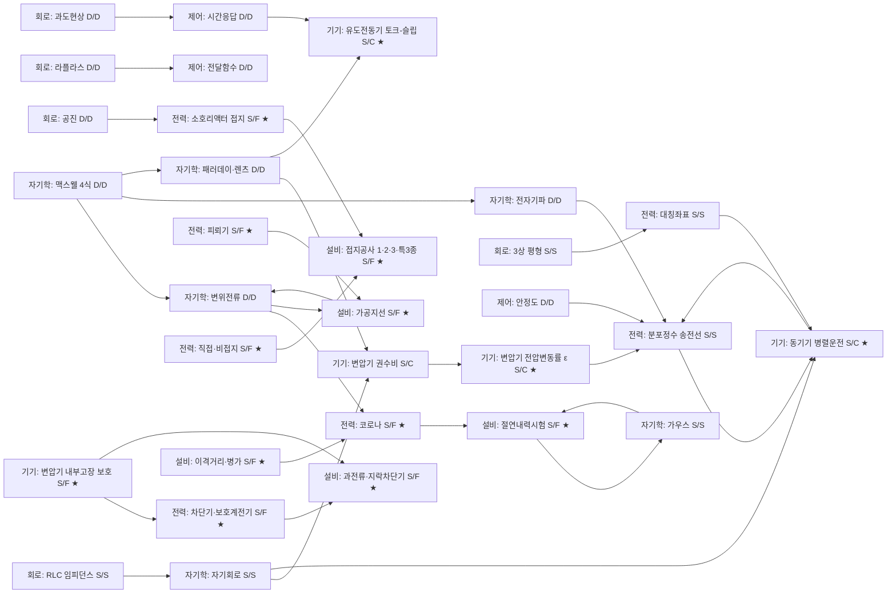

# 전기기사 6과목 통합 학습 지도 v0 (2026-05-25)

> **v0 첫 초안**. 완성본 아님. 6과목을 한 덩어리로 보는 첫 그림 영역. 부족한 부분은 v1/v2에서 보완.
>
> **source**: `docs/audit/input/전기기사_6과목_라벨링_v3.2_corrected_actionable_20260522.md` 직접 입력.
> 자기학 D/D 7항·정적 5항은 v3.2 통계 입력 + 본 채널 추정 영역 → "v1 검증 필요" 표시.
> 6과목 정직 학습 5항 (자기학·회로이론·제어공학)은 v3.2 source 외 영역 → "v1 검증 필요" 표시.

---

## 1. 한 문단 요약

전기기사 6과목은 표면적으로 별 6 과목 영역이지만, 본질은 **정적 현상 / 동적 현상 / 고장·과도 현상 / 에너지 변환 현상**의 4 가지 현상 영역이 6 과목에 분산 배치된 영역이다. 시험은 모두 정적 규칙으로 묻지만, 전기기기·전기설비·전력공학의 ★4~5 함정 61항 (전체 ★4~5 182항 중 33.5%)은 동적·고장·변환 현상을 정적 규칙으로 압축한 영역에서 발생한다. 본 v0 지도는 6 과목 각각의 정적 5 주제 + 동적/고장/변환 5 주제 = 총 60 주제 영역과 과목 간 연결을 한 화면으로 본다.

---

## 2. 6과목 통합 관점

### 2.1 v3.2 입력 통계

| 과목 | 항 수 | S/S | D/D | S/F | S/C | 함정 합 | ★4~5 | ★4~5 함정 비율 |
|---|--:|--:|--:|--:|--:|--:|--:|--:|
| 전기자기학 | 60 | 47 | 7 | 0 | 0 | 0 | 32 | 0% |
| 회로이론 | 63 | 35 | 16 | 1 | 0 | 4 | 36 | 5.6% |
| 제어공학 | 47 | 8 | 37 | 0 | 0 | 0 | 25 | 0% |
| 전력공학 | 70 | 34 | 7 | 23 | 2 | 25 | 29 | 37.9% |
| 전기기기 | 59 | 5 | 8 | 3 | 39 | 42 | 30 | 90.0% |
| 전기설비 | 83 | 37 | 0 | 45 | 0 | 45 | 30 | 70.0% |
| **합** | **382** | **166** | **75** | **72** | **41** | **116** | **182** | **33.5%** |

### 2.2 6 과목의 4 영역 분류

**영역 A — 정직 학습 과목 (S/S + D/D 본질 일치, ★4~5 함정 ≈ 0)**:
- **전기자기학** (S/S 47 + D/D 7, 함정 0)
- **제어공학** (D/D 37 = 시험·본질 일치, 함정 0)
- **회로이론** (S/S 35 + D/D 16, 함정 4 = 5.6%)

→ 공식·도구 암기 + 계산 연습으로 점수 영역.

**영역 B — 함정 학습 과목 (S/F + S/C 본질 다름, ★4~5 함정 비율 30%+)**:
- **전기기기** (S/C 39 + S/F 3, 함정 71.2%)
- **전기설비** (S/F 45, 함정 54.2%)
- **전력공학** (S/F 23, 함정 35.7%)

→ 외울 것 + 이해할 것 분리 필수. 본질 모르면 응용·변형 영역 무력.

### 2.3 통합 시각의 핵심

- **정직 학습 과목 (자기학·회로이론·제어공학)**은 **시험 = 본질**: 공식 외우면 본질 영역 일치.
- **함정 학습 과목 (기기·설비·전력)**은 **시험 ≠ 본질**: 시험은 정적, 본질은 동적/고장/변환 영역.
- 자기학의 **변위전류·전자기파·맥스웰 방정식** (D/D 7항)이 전력공학 코로나·전기기기 자속 결합·전기설비 절연 영역으로 이어지는 다리 영역.

---

## 3. 정적 vs 동적 핵심 차이

| 영역 | 정적 (Static) | 동적 (Dynamic) |
|---|---|---|
| 시간 변수 | 없음 (시불변) | 있음 (시변) |
| 시험 출제 양식 | 공식 대입·수치 계산 | 시간 응답·과도 응답·시변 신호 |
| 본질 | 정상상태 / 평형 | 변화 / 응답 / 변환 |
| 학습 영역 | 공식·도구 암기 | 현상 이해 + 모델링 |
| 함정 발생 영역 | 0 (정직) | 0 (정직) |
| **함정 발생 변환 영역** | **S/F (고장 → 정적 규칙)** | **S/C (에너지 변환 → 정상상태 모델)** |

**핵심 가설**:
- 같은 ★5라도 **정적 공식형**과 **과목 간 연결형**은 학습 가치 다름.
- 시험은 정적으로 묻지만 본질은 동적·고장·변환 영역 → 정적 규칙 압축이 함정 원인.

---

## 4. 현상기원 4분류

| 분류 | 정의 | 시험 양식 | 본질 영역 | 대표 과목 |
|---|---|---|---|---|
| **S/Static** | 정적 현상을 정적으로 묻는 영역 | 정적 공식 대입 | 시불변 평형 | 자기학 47 / 회로 35 / 설비 37 |
| **D/Dynamic** | 동적 현상을 동적으로 묻는 영역 | 시간 응답·시변 신호 | 시변 응답 | 제어 37 / 회로 16 / 자기 7 |
| **S/Fault** | 고장·과도 현상을 정적 규칙으로 묻는 영역 | 보호 규칙·수치 | 사고 시 동작 | **설비 45 / 전력 23 / 기기 3** |
| **S/Conversion** | 에너지 변환을 정상상태 모델로 묻는 영역 | 등가회로·정상상태 식 | 시변 자속·회전 변환 | **기기 39 / 전력 2** |

**핵심 관찰**:
- **S/F 72항** = 시험 = 정적 규칙 / 본질 = **고장·과도 동적 사고**. 평상시 기능이 아니라 **사고 시 동작** 영역.
- **S/C 41항** = 시험 = 정상상태 등가회로 / 본질 = **시변 자속 + 회전 변환**. 변압기·회전기 거의 전부 영역.

---

## 5. 6과목별 핵심 주제 10개

### 5.1 전기자기학 (정직 학습 — 함정 0)

| 주제 | 별 | 분류 | 정적/연결 | 이어지는 과목 | 학습 메모 |
|---|---|---|---|---|---|
| 쿨롱 법칙 | ★5 | S/S | 정적 공식형 | 회로 (전계·전위) | 정직 ★5 — 공식 암기 (v1 검증 필요) |
| 가우스 법칙 | ★5 | S/S | 정적 공식형 | 전력 (절연·코로나) | 정직 ★5 — 대칭 영역 적분 (v1 검증 필요) |
| 콘덴서 정전용량 | ★5 | S/S | 정적 공식형 | 회로 RLC / 전력 (정전용량) | 정직 ★5 — 평행판·동심구·원통 (v1 검증 필요) |
| 자기회로·인덕턴스 | ★5 | S/S | 연결형 | **기기 (변압기·회전기 자속 결합)** | **다리 주제** — S/C 영역의 정적 출발점 |
| 경계조건 (E·D·B·H) | ★4 | S/S | 정적 공식형 | 설비 (절연 매질) | 정직 ★4 — 굴절·연속성 (v1 검증 필요) |
| **변위전류** | ★5 | D/D | **연결형** | **전력 코로나 / 설비 절연** | **다리 주제** — Maxwell 4식 핵심 (v1 검증 필요) |
| **전자기파 전파** | ★5 | D/D | **연결형** | **전력 (송전선 분포정수) / 통신** | **다리 주제** — 파동 방정식 (v1 검증 필요) |
| **맥스웰 방정식** | ★5 | D/D | **연결형** | **자기학 모든 영역 / 전력 / 설비** | **다리 주제** — 4식 통합 (v1 검증 필요) |
| 패러데이·렌츠 법칙 | ★5 | D/D | **연결형** | **기기 (변압기·회전기 유도기전력)** | **다리 주제** — S/C 영역의 동적 출발점 |
| 전자기 유도 (시변 자속) | ★4 | D/D | 연결형 | 기기 (유도전동기) | (v1 검증 필요) |

### 5.2 전력공학 (★4~5 함정 11항)

| 주제 | 별 | 분류 | 정적/연결 | 이어지는 과목 | 학습 메모 |
|---|---|---|---|---|---|
| 송전선 정수 (RLGC) | ★5 | S/S | 정적 공식형 | 회로 (분포정수) | 정직 — 1km 당 정수 (v1 검증 필요) |
| 전압강하·전력손실 | ★5 | S/S | 정적 공식형 | 설비 (이격거리) | 정직 — 단상/3상 공식 (v1 검증 필요) |
| 단락·지락 계산 | ★4 | S/S | 연결형 | 설비 (보호) / 기기 (%Z) | (v1 검증 필요) |
| 대칭좌표법 | ★4 | S/S | 정적 공식형 | 회로 (3상 불평형) | 정직 — 영상·정상·역상 (v1 검증 필요) |
| 송전용량·안정도 | ★4 | S/S | 연결형 | 기기 (동기기 안정도) | (v1 검증 필요) |
| **코로나 현상** | ★5 | **S/F** | **연결형** | **자기학 변위전류 / 설비 절연** | **함정 ★5 A** — Peek식 + 동적 방전 본질 |
| **피뢰기 LA** | ★5 | **S/F** | **연결형** | **설비 절연·접지** | **함정 ★5 A** — 제한전압 + 비선형 보호 |
| **소호리액터 접지** | ★5 | **S/F** | **연결형** | **회로 공진 / 설비 접지** | **함정 ★5 A** — 공진 자기소호 |
| **직접접지·비접지** | ★5 | **S/F** | **연결형** | **설비 접지 / 통신 유도** | **함정 ★5 A** — 4 방식 trade-off |
| **차단기·보호계전기** | ★4 | **S/F** | **연결형** | **기기 (변압기 보호) / 설비 (지락차단기)** | **함정 ★4 A/B** — 소호매질 + 사고 유형별 |

### 5.3 전기기기 (★4~5 함정 27항)

| 주제 | 별 | 분류 | 정적/연결 | 이어지는 과목 | 학습 메모 |
|---|---|---|---|---|---|
| 변압기 권수비·전압비 | ★5 | S/C | 연결형 | 자기학 (자속 결합) | 외울 것: a=N1/N2 = V1/V2 = I2/I1, Z1=a²Z2 |
| 직류기 유기기전력 공식 | ★5 | S/C | 정적 공식형 | 자기학 (패러데이) | 외울 것: E=PZΦN/60a (v1 검증 필요) |
| 동기속도 공식 | ★5 | S/C | 정적 공식형 | 자기학 (회전계) | 외울 것: Ns=120f/P (v1 검증 필요) |
| 슬립·토크-슬립 | ★5 | S/C | 정적 공식형 | 자기학 (유도) | 외울 것: s=(Ns-N)/Ns, T∝V² |
| 변압기 %Z·%R·%X | ★5 | S/C | 연결형 | 전력 (단락 계산) | 외울 것: %z=√(p²+q²) |
| **동기발전기 병렬운전** | ★5 | **S/C** | **연결형** | **자기학 자속 결합** | **함정 ★5 A** — 4조건 + 동기화 본질 |
| **변압기 전압변동률 ε** | ★5 | **S/C** | **연결형** | **전력 (전압강하)** | **함정 ★5 A** — ε=pcosθ±qsinθ + 부하 위상 |
| **유도전동기 토크-슬립** | ★5 | **S/C** | **연결형** | **자기학 (회전계 상대속도)** | **함정 ★5 A** — T∝V² + s=0 영역 |
| **유도전동기 비례추이** | ★5 | **S/C** | **연결형** | **제어 (제어 변수)** | **함정 ★5 A** — r2/s=일정, 최대토크 위치 이동 |
| **변압기 내부고장 보호** | ★4 | **S/F** | **연결형** | **전력 (차동계전기) / 설비 (보호계전기)** | **함정 ★4 A** — 비율차동 + 부흐홀츠 |

### 5.4 회로이론 (★4~5 함정 2항)

| 주제 | 별 | 분류 | 정적/연결 | 이어지는 과목 | 학습 메모 |
|---|---|---|---|---|---|
| 옴의 법칙·KVL·KCL | ★5 | S/S | 정적 공식형 | 모든 과목 | 정직 — 회로 기본 (v1 검증 필요) |
| 직병렬·등가회로 | ★5 | S/S | 정적 공식형 | 기기 (등가회로) | 정직 — 환산법 (v1 검증 필요) |
| RLC 직병렬 임피던스 | ★5 | S/S | 연결형 | 자기학 (콘덴서·인덕턴스) | 정직 — 복소수 임피던스 (v1 검증 필요) |
| 테브난·노턴 등가 | ★4 | S/S | 정적 공식형 | 기기 (등가) | 정직 (v1 검증 필요) |
| 3상 평형·불평형 | ★5 | S/S | 연결형 | 전력 (대칭좌표) | 정직 (v1 검증 필요) |
| **과도현상 (RL·RC)** | ★5 | D/D | **연결형** | **제어 (1차 시스템)** | **다리 주제** — 시정수·과도응답 (v1 검증 필요) |
| **공진 (직렬·병렬)** | ★5 | D/D | **연결형** | **전력 (소호리액터 공진)** | **다리 주제** — Q·대역폭 (v1 검증 필요) |
| **라플라스 변환** | ★5 | D/D | **연결형** | **제어 (전달함수)** | **다리 주제** — s 영역 변환 (v1 검증 필요) |
| **2단자망·4단자망** | ★4 | D/D | 연결형 | 제어 (블록선도) | (v1 검증 필요) |
| **실효값·평균값** | ★4 | **S/D** | **연결형** | **전력 (실효값 계산)** | **함정 ★4 B** — 시변 파형 → 등가 DC 압축 |

### 5.5 제어공학 (정직 학습 — 함정 0)

| 주제 | 별 | 분류 | 정적/연결 | 이어지는 과목 | 학습 메모 |
|---|---|---|---|---|---|
| 라플라스·전달함수 | ★5 | D/D | 연결형 | 회로 (라플라스) | 정직 — s 영역 (v1 검증 필요) |
| 블록선도·신호흐름도 | ★5 | D/D | 정적 공식형 | 회로 (4단자망) | 정직 — Mason 공식 (v1 검증 필요) |
| 안정도 (Routh·Nyquist) | ★5 | D/D | 연결형 | 전력 (계통 안정도) | 정직 — 특성방정식 (v1 검증 필요) |
| 근궤적법 | ★5 | D/D | 정적 공식형 | 자기학 (개념 무) | 정직 — 분리점·교차점 (v1 검증 필요) |
| 주파수응답 (Bode) | ★5 | D/D | 연결형 | 회로 (공진) | 정직 — 이득·위상 (v1 검증 필요) |
| **시간응답 (과도·정상)** | ★5 | D/D | **연결형** | **회로 (과도현상) / 기기 (속도응답)** | **다리 주제** — ωn·ζ |
| **PID 제어** | ★5 | D/D | **연결형** | **기기 (속도제어)** | **다리 주제** — P·I·D 영역 |
| **샘플링·z변환** | ★4 | D/D | 연결형 | (디지털 영역) | (v1 검증 필요) |
| **상태방정식** | ★4 | D/D | 연결형 | 자기학 (시변 영역) | (v1 검증 필요) |
| **상태천이행렬** | ★4 | D/D | 정적 공식형 | (v1 검증 필요) | (v1 검증 필요) |

### 5.6 전기설비기술기준 (★4~5 함정 21항)

| 주제 | 별 | 분류 | 정적/연결 | 이어지는 과목 | 학습 메모 |
|---|---|---|---|---|---|
| 전압 구분 (저·고·특고압) | ★5 | S/S | 정적 공식형 | 전력 (송전 전압) | 정직 — 1kV·7kV 기준 (v1 검증 필요) |
| 전선 굵기·전류용량 | ★5 | S/S | 정적 공식형 | 회로 (전류) | 정직 (v1 검증 필요) |
| 인입선·배선 시설 | ★4 | S/S | 정적 공식형 | (v1 검증 필요) | (v1 검증 필요) |
| KEC 기준 | ★5 | S/S | 정적 공식형 | 전력 / 설비 | 정직 (v1 검증 필요) |
| 옥내·옥외 배선 | ★4 | S/S | 정적 공식형 | (v1 검증 필요) | (v1 검증 필요) |
| **절연내력시험전압** | ★5 | **S/F** | **연결형** | **자기학 절연 / 전력 이상전압** | **함정 ★5 A** — 사고성 과전압 여유 |
| **접지공사 (1·2·3·특3종)** | ★5 | **S/F** | **연결형** | **전력 접지방식** | **함정 ★5 A** — 지락 시 위험전압 억제 |
| **이격거리·병가** | ★5 | **S/F** | **연결형** | **전력 (절연 거리)** | **함정 ★5 B** — 절연파괴 + 접촉 방지 |
| **과전류·지락차단기** | ★4 | **S/F** | **연결형** | **전력 보호계전기 / 기기 보호** | **함정 ★4 A** — 별 사고 별 차단 |
| **가공지선·낙뢰 보호** | ★4 | **S/F** | **연결형** | **자기학 변위전류 / 전력 피뢰기** | **함정 ★4 B** — 낙뢰 흡수 + 대지 흘림 |

---

## 6. 과목 간 연결 화살표

| from → to | 영역 | 화살표 의미 |
|---|---|---|
| 자기학 변위전류 → 전력 코로나 | D/D → S/F | 도체 표면 전계 + 공기 절연 파괴 |
| 자기학 맥스웰 → 자기학 모든 영역 | D/D → S/S+D/D | 4식 통합 framework |
| 자기학 패러데이·렌츠 → 기기 변압기·회전기 | D/D → S/C | 유도기전력 본질 |
| 자기학 자기회로 → 기기 변압기 등가회로 | S/S → S/C | 자속 결합 정적 모델 |
| 자기학 전자기파 → 전력 분포정수 송전선 | D/D → S/S | 파동 방정식 |
| 회로 RLC → 자기학 콘덴서·인덕턴스 | S/S → S/S | 회로 ↔ 장 |
| 회로 과도현상 → 제어 시간응답 | D/D → D/D | 시정수·과도응답 |
| 회로 공진 → 전력 소호리액터 접지 | D/D → S/F | 공진 자기소호 |
| 회로 라플라스 → 제어 전달함수 | D/D → D/D | s 영역 변환 |
| 회로 3상 평형 → 전력 대칭좌표법 | S/S → S/S | 3상 불평형 |
| 제어 시간응답 → 기기 유도전동기 속도응답 | D/D → S/C | 동적 응답 |
| 제어 PID → 기기 속도제어 | D/D → S/C | 제어 변수 |
| 제어 안정도 → 전력 계통 안정도 | D/D → S/S | 시스템 안정도 |
| 기기 변압기 %Z → 전력 단락 계산 | S/C → S/S | 임피던스 → 사고전류 |
| 기기 동기기 안정도 → 전력 송전 안정도 | S/C → S/S | 동기기 ↔ 계통 |
| 기기 변압기 내부고장 → 전력 차동계전기 | S/F → S/F | 보호 framework |
| 기기 변압기 내부고장 → 설비 보호계전기 | S/F → S/F | 사고 별 차단 |
| 전력 코로나 → 설비 절연 | S/F → S/F | 공기 절연 한계 |
| 전력 접지방식 → 설비 접지공사 | S/F → S/F | 1·2·3·특3종 적용 |
| 전력 피뢰기 → 설비 가공지선 | S/F → S/F | 낙뢰 보호 |
| 전력 보호계전기 → 설비 과전류·지락차단기 | S/F → S/F | 사고 별 차단 |
| 설비 절연내력시험 → 자기학 절연 | S/F → S/S | 매질 절연 |
| 설비 가공지선 → 자기학 변위전류 | S/F → D/D | 낙뢰 흡수 |
| 설비 이격거리 → 전력 코로나 | S/F → S/F | 절연 거리 |

---

## 7. 한 장 지도 (mermaid)

v0 단순화 영역: 60 노드 전수 영역 안 함. ★5 + 동적/Fault/Conversion 핵심 노드 24개.

**노드 영역 (24개)**:
- 자기학 6 (★5 + D/D 5 + S/S 1)
- 회로 5 (★5 + D/D 3 + S/S 2)
- 제어 3 (★5 D/D 3)
- 기기 5 (★5 + S/C 4 + S/F 1)
- 전력 7 (★5 + S/F 5 + S/S 2)
- 설비 5 (★5 + S/F 5)

**핵심 다리 영역**:
- 자기학 D/D 4 → 기기 S/C 영역
- 자기학 D/D 1 → 전력 S/F 영역
- 회로 D/D → 제어 D/D + 전력 S/F 영역
- 기기 S/F → 전력·설비 S/F 영역
- 전력 S/F ↔ 설비 S/F (양방향)
- 설비 S/F → 자기학 S/S+D/D (역방향)

---

## 8. 이 지도를 실제 공부에 사용하는 방법

**3단계 학습 순서** (사용자 명시 가설 5):

1. **현상 이야기** — 본 v0 지도의 화살표를 따라가며 6 과목이 같은 현상의 다른 측면 영역임 인식. 예: 자기학 변위전류 → 전력 코로나 → 설비 절연내력시험은 같은 "공기 절연 한계" 현상 영역.
2. **공식/규칙** — 각 주제의 외울 것 (공식·수치) 영역 암기. 함정 ★5 영역은 외울 것 + 이해할 것 분리.
3. **대표 문제 함정 확인** — v3.2 source `docs/audit/input/전기기사_6과목_라벨링_v3.2_corrected_actionable_20260522.md` §4 ★4~5 함정 61항 영역의 대표 보기 함정 영역 직접 검토.

**우선순위**:
- 본 v0 ★ 표시 항목 = v3.2 함정 우선순위 A 영역 (외운 공식만으로 응용·변형 영역 어려움) — 먼저 학습.
- 정직 학습 과목 (자기학·회로이론·제어공학)은 공식 영역 + 다리 주제 (D/D 영역) 영역 추가 학습.

---

## 9. 다음 단계

| 방법 | 영역 |
|---|---|
| **방법 B** | 4분류 (S/S·D/D·S/F·S/C) 영역을 ★4~5 182항 전체로 확장. 본 v0 60 주제 → 182 주제 영역 확장. |
| **방법 C** | 전체 노드 (382항) + 화살표 영역 전수 지도화. mermaid 다중 차원 분할 영역 (정직·다리·함정 영역 별 분리). |

**v1 검증 필요 영역**:
- 자기학 정적 5 주제 + 동적 5 주제 (v3.2 source D/D 7항 영역 외 본 채널 추정)
- 회로이론 정적 5 + 동적 5 주제 (D/D 16항 영역 중 5 선정 본 채널 추정)
- 제어공학 D/D 10 주제 (D/D 37항 영역 중 10 선정 본 채널 추정)
- 전력공학 정적 5 주제 (S/S 34항 영역 중 5 선정 본 채널 추정)
- 전기기기 정적 5 주제 (S/S 5항 외 S/C 영역 중 5 선정 본 채널 추정)
- 전기설비 정적 5 주제 (S/S 37항 영역 중 5 선정 본 채널 추정)

**v0 한계 명시**:
- 본 v0는 첫 그림 영역 한정. 완벽 영역 아님.
- 6 × 10 = 60 주제 중 약 30 주제 = v3.2 source 직접 입력 (★4~5 함정 + S/C 영역). 나머지 30 주제 = 본 채널 추정 영역 (v1 검증 필요).
- mermaid 24 노드는 핵심 영역만 — 전체 60 노드 + 24+ 화살표 영역은 방법 B/C 영역.

---

## Status

- 전기기사 6과목 통합 학습 지도 v0 초안 완료.
- source: v3.2 라벨링 (`docs/audit/input/...20260522.md`) 직접 read 입력.
- 6 × 10 = 60 핵심 주제 표 + 과목 간 연결 화살표 24개 + mermaid 24 노드 한 장 지도.
- 정직 학습 과목 (자기학·회로이론·제어공학) vs 함정 학습 과목 (기기·설비·전력) 영역 분리.
- 현상기원 4분류 (S/Static·D/Dynamic·S/Fault·S/Conversion) 영역 매핑.
- ★4~5 함정 ★ 표시 24개 (기기 5 / 설비 5 / 전력 5 / 회로 1 / 합 16 + 다리 주제 ★ 표시 8개).
- 본 v0는 docs-only 학습 구조화 문서 한정. trap-map / alias / registry / source audit 영역 진입 0.
- app code / app data / questions.json / per-year / pdf_pages / PDF / registry artifact / JSONL / MEMORY.md / Obsidian 모두 변경 0.
- v1/v2 영역 후속 보완 영역: 자기학 D/D 7항 정확 매핑 / 6 과목 정직 학습 ★5 영역 직접 검증 / 방법 B (★4~5 182항 전체 4분류) / 방법 C (382항 전수 지도화).
